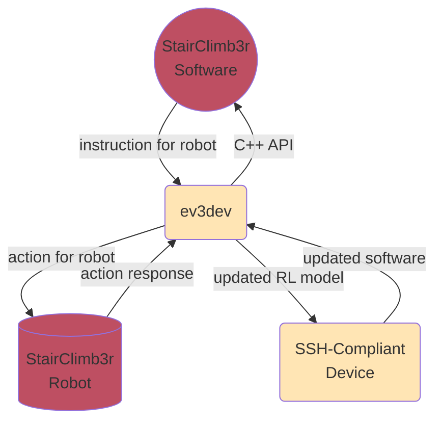

# StairClimb3r Software Requirements Specification

## 1) Introduction
### 1.1) Purpose
This software requirements specification document describes the functional and nonfunctional requirements for software release 1.0 of StairClimb3r. This document is intended to be used by all project contributors and should serve as the central definition of project requirements. Unless otherwise noted, all requirements specified here are committed for release 1.0.

### 1.2) Document conventions
No special typographical conventions are used in this SRS.

### 1.3) Project scope
StairClimb3r will encapsulate a Lego Mindstorms EV3-based robotic system that will learn to climb up and down stairs through trial and error. Software for this project will be responsible for controlling robot hardware and training it to interact with its environment. For the full project roadmap, see *StairClimb3r Roadmap*[1].

### 1.4) References
1. Farrell, Alex. *StairClimb3r Roadmap*, [Project Roadmap](../PROJECT_VISION/ROADMAP.md).
2. Holzmann, Gerard. *The Power of Ten – Rules for Developing Safety Critical Code*, https://spinroot.com/gerard/pdf/P10.pdf.
3. Stroustrup, Sutter. *C++ Core Guidelines*, https://isocpp.github.io/CppCoreGuidelines/CppCoreGuidelines
4. Rossum, Warsaw, Coghlan. *PEP 8 – Style Guide for Python Code*, https://peps.python.org/pep-0008/
5. Mermaid-js. *Mermaid Documentation*, https://mermaid-js.github.io/mermaid/#/

## 2) Overall description
### 2.1) Product perspective
StairClimb3r is a new robotic system that is intended to be used for educational purposes (i.e. demonstrating how reinforcement learning can be used in contemporary robotics). The context diagram below illustrates all external entities and system interfaces for release 1.0.

### 2.2) User classes and characteristics
| User Class | Description |
|------------|-------------|
| Project Developers (favored) | Any developers contributing to StairClimb3r. They are the primarily targeted user class as this project is intended for hands-on practice implementing reinforcement learning in a robotics context. | 
| Other Developers | Developers of other, unrelated projects. All code will be released as open-source and can be used by developers in other projects. |

### 2.3) Operating environment
*OE-1*: Project software shall operate on the Lego Mindstorms EV3 Intelligent Brick with ev3dev, an embedded Linux distribution based on Debian, version 2020-04-10 installed.

*OE-2*: Project software shall be accessed and updated through SSH communication between ev3dev and any SSH-compliant device.

### 2.4) Design and implementation constraints
*CO-1*: Project documentation shall use markdown format for quick, maintainable updates.

*CO-2*: Project documentation shall use Mermaid (see *Mermaid Documentation*[5]) for all diagrams for quick, maintainable updates.

*CO-3*: Project software shall conform to *The Power of Ten – Rules for Developing Safety Critical Code*[2] as risk of system failure should be minimized during robot training.

*CO-4*: Project software shall use Google Tensorflow version 2 for all Artifical Intelligence as learning algorithms must be efficient and secure.

*CO-5*: Project software shall use C++ for robot interaction and control as development language must be supported out-of-the-box on ev3dev and provide a balance of real-time performance and scalability.

*CO-6*: Project software shall use C++ or Python for Artificial Intelligence as development language must be supported out-of-the-box on ev3dev and Tensorflow.

*CO-7*: Project software written in C++ shall conform to the *C++ Core Guidelines*[3] for standardized code development.

*CO-8*: Project software written in Python shall conform to *PEP 8 – Style Guide for Python Code*[4] for standardized code development.

### 2.5) Assumptions and dependencies
*AS-1*: Users of this software will have their own robot hardware built with ev3dev installed.

*DE-1*: Google Tensorflow version 2 must be installed on ev3dev. 

## 3) System features
### 3.x System feature X
#### 3.x.1 Description
#### 3.x.2 Functional requirements

## 4) Data requirements
### 4.1) Logical data model

### 4.2) Data dictionary

### 4.3) Reports

### 4.4) Data acquisition, integrity, retention, and disposal

## 5) External interface requirements
### 5.1) User interfaces

### 5.2) Software interfaces

### 5.3) Hardware interfaces

### 5.4) Communications interfaces

## 6) Quality attributes
### 6.1) Usability

### 6.2) Performance

### 6.3) Security

### 6.4) Safety

### 6.x [others]

## 7) Internationalization and localization requirements

## 8) Other requirements

## Appendix A: Glossary

## Appendix B: Analysis models
